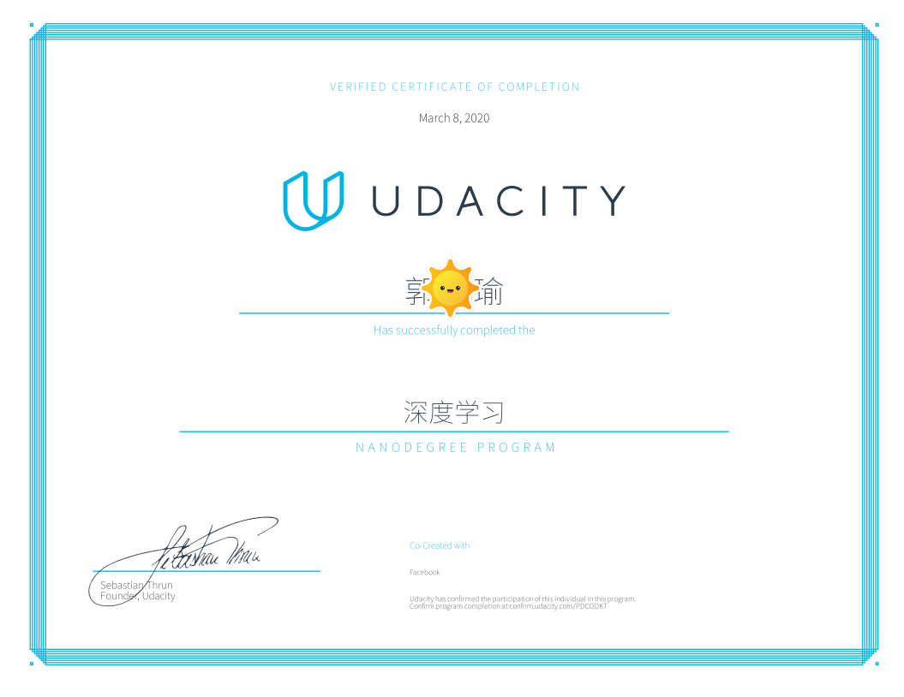

# Udacity - Deep Learning Nanodegree

# Udacity深度学习纳米学位项目

1. [预测共享单车使用情况](https://github.com/udacity/Predicting-Bike-Sharin-Patterns)

2. [小狗品种分类器](https://github.com/udacity/Dog-Breed-Classifier)

3. [电视剧剧本生成](https://github.com/udacity/Generate-TV-scripts)

4. [生成人脸](https://github.com/udacity/Generate-Faces)